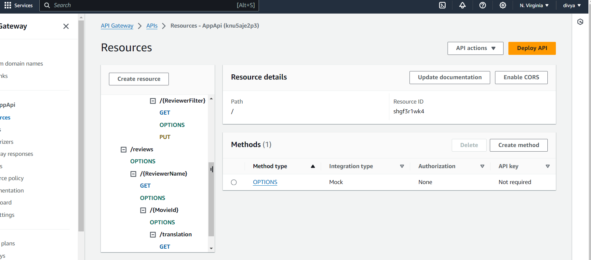

Serverless REST Assignment.
Name Divya Maria Appachan

Video demonstration: [..... URL of your Youtube video demonstration ....](https://www.youtube.com/watch?v=rlLDLbz3Pwo)

This repository contains an implementation of a serverless REST API for the AWS platform. The CDK framework is used to provision its infrastructure. The API's domain context is movie reviews.

API endpoints.

Post/auth/signup- for signup of email
Post/auth/confirm_signup- confirm signup using verification code
Post/auth/confirm_signin- for the getting token
Post/auth/confirm_signout - for the signout from application

POST /movies/reviews - add a movie review.

GET /movies/{MovieId}/reviews - Get all the reviews for the specified movieID.

GET /movies/{MovieId}/reviews?minRating=n - Get the reviews for the specified movie with a rating greater than the minRating.

PUT /movies/{MovieId}/reviews/{reviewerName} - Update the text of a review.

FOR below end point the api gate way definf in single path like 

GET /movies/{movieId}/reviews/{ReviewFilter} and check the ReviewFilter is number or not. If it number, it will give GET /movies/{movieId}/reviews/{year} else  GET /movies/{movieId}/reviews/{reviewerName}.

GET /movies/{movieId}/reviews/{reviewerName} - Get the review written by the named reviewer for the specified movieID.

GET /movies/{movieId}/reviews/{year} - Get the reviews written in a specific year for a specific movieID.

GET /reviews/{ReviewerName} - Get all the reviews written by a specific reviewer.

GET /reviews/{ReviewerName}/{MovieId}/translation?language=code - Get a translated version of a movie review using the movie ID and reviewer name as the identifier.

[Include screenshots from the AWS management console (API Gateway service) that clearly show the deployed API ( ensure the font size is legible). ]

Authentication 
[Include a screenshot from the AWS management console (Cognito User Pools) showing a confirmed user account.]

Learning .
Used refactoring of mulistack .App api and auth api refactored to auth-app-stack.

created GlobalSecondaryIndex table ,which help last two endpoint operation more easily and less time is required to excute those endpoint .

Add transaltion endpoint with iam role.

GET /reviews/{ReviewerName}/{MovieId}/translation?language=code - Get a translated version of a movie 

